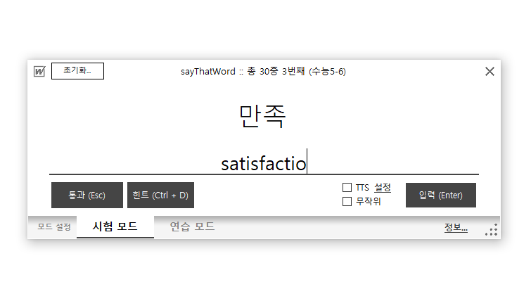

# sayThatWord (세이댓워드)
## 소개
sayThatWord는 간단하게 사용할 수 있는 암기 퀴즈 프로그램입니다. 문자로 입력 가능한 문제 - 답 형식의 퀴즈이면 무엇이든지 가능합니다. 현재는 영단어 위주로 제작하고 있는 중입니다.

## 특징
- 별도 라이브러리가 필요없는 매우 간단한 WinForm 앱
- Windows TTS를 사용하여 프로그램 이용시 발음 청취 가능 (현재 영어만 지원)
- 스프레드시트 프로그램을 통해 편집 가능한 텍스트 형식의 단어장 (Tab으로 분리)
- 정답을 보고 따라 입력하는 '연습 모드'
- 오답 문항을 따로 추려내어 단어장 저장 가능
- 랜덤 문제 풀기 가능

## 스크린샷

